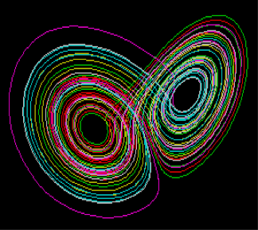
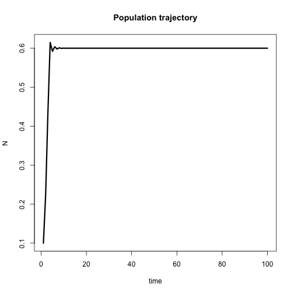
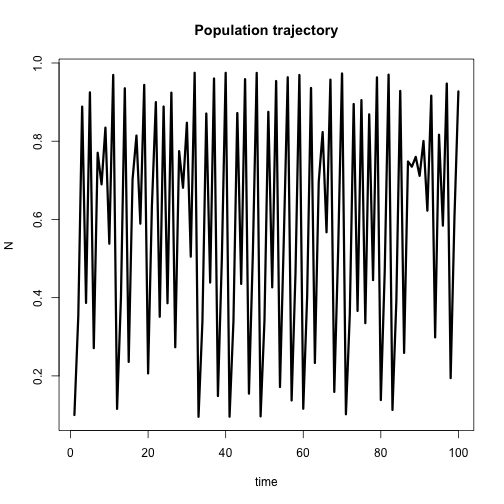

Simulating Chaotic Dynamics: A shiny app to explore the quadratic map
========================================================
author: Jorge A. Ahumada 
date: March 24, 2016
autosize: true
*

Understanding complex dynamics
========================================================

## A system with chaotic dynamics has the following properties

- Chaos is deterministic; ie. not the result of a random process
- Dynamics of the system is sensitive to **initial conditions**
- Chaotic systems look unpredictable but they have special equilibria called **attractors**
- I built an app to explore a simple recursive equation that generates chaotic dyanmics

A simple system
========================================================
left:40%
The quadratic map is a recursive equation that has been used in population modelling.

$N_{t+1} = rN_t(1-N_t)$

Because it only depends on parameter *r*, it is easy to explore its behavior
***

Changing r
========================================================
By changing the value of *r* the trajectory of the system changes.

For example when *r* = 3.9:

***

This is chaos!

The app
==========================
The app that I have created explores the dynamics of this equation by changing two things:

- The value of *r*
- The initial conditions (the initial value or $N_0$)

In addition to ploting the trajectory of the system, the app also plots a **cobweb diagram** to explore the equilibria and chaotic attractors.

You can play with it at [https://jaap.shinyapps.io/chaosApp/](https://jaap.shinyapps.io/chaosApp/)

Have fun!
